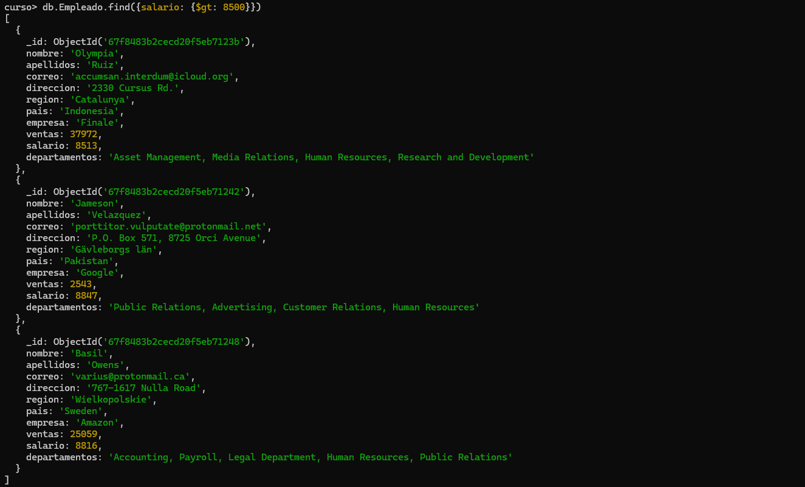
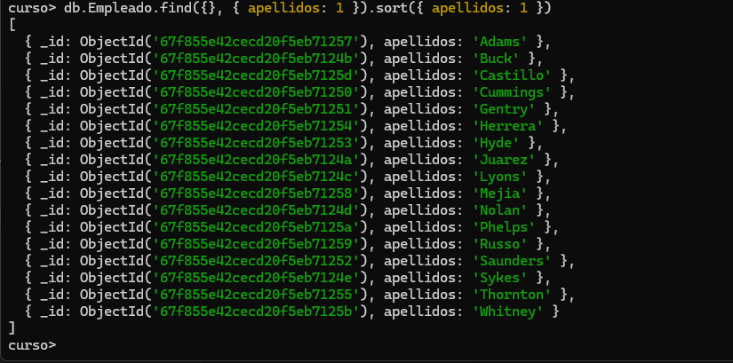

# **Practica 3. Updates y Deletes**

1. Cambiar el salario del empleado Imogene Nolan. Se le asigna 8000.
```json
db.Empleado.updateOne(
    {
        nombre: 'Imogene',
        apellidos: 'Nolan'
    },
    {
        $set: {salario: 8000}
    }
)
```


2. Cambiar "Belgium" por "Bélgica" en los empleados (debe haber dos).
```json
db.Empleado.updateMany(
    {
        pais: 'Belgium'
    },
    {
        $set: {pais: 'Bélgica'}
    }
)
```


4. Reemplazar el empleado Omar Gentry por el siguiente documento:

```json
{
"nombre": "Omar",
"apellidos": "Gentry",
"correo": "sin correo",
"direccion": "Sin calle",
"region": "Sin region",
"pais": "Sin pais",
"empresa": "Sin empresa",
"ventas": 0,
"salario": 0,
"departamentos": "Este empleado ha sido anulado"
}
```

```json
db.Empleado.replaceOne(
{
    nombre: 'Omar'
},
{
"nombre": "Omar",
"apellidos": "Gentry",
"correo": "sin correo",
"direccion": "Sin calle",
"region": "Sin region",
"pais": "Sin pais",
"empresa": "Sin empresa",
"ventas": 0,
"salario": 0,
"departamentos": "Este empleado ha sido anulado"
}
)
```


5. Con un find comprobar que el empleado ha sido modificado

```json
db.Empleado.find({nombre: 'Omar'})
```


6. Borrar todos los empleados que ganen mas de 8500. Nota: deben ser borrados 3 documentos
```json
db.Empleado.deleteMany({salario: {$gt: 8500}})
```



7. Visualizar con una expresión regular todos los empleados con apellidos que comiencen con "R"
```json
db.Empleado.find({apellidos: {$regex: /^R/i}})
```


8. Buscar todas las regiones que contenga un "V". Hacerlo con el operador $regex y que no distinga mayúsculas y minúsculas. Deben salir 2.
```json
db.Empleado.find({region: {$regex: /V/i}})
```


9. Visualizar los apellidos de los empleados ordenados por el propio apellido.
```json
db.Empleado.find({},{apellidos:1}).sort({apellidos: 1})
```


10. Indicar el número de empleados que trabajan en Google.
```json
db.Empleado.find({empresa: 'Google'}).size()
```


11. Borrar la colección empleados y la base de datos
```json
db.Empleado.drop()
db.dropDatabase()
```


"Logro: Practicas de MongoDB terminadas"
